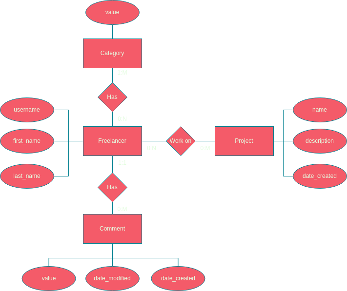

# Hibernate Search 6 Example

Simple Spring Boot application demonstrating Hibernate Search 6 usage with Elasticsearch.

[Hibernate Search 6.1.7.Final: Reference Documentation](https://docs.jboss.org/hibernate/stable/search/reference/en-US/html_single/)

# Example app

ER diagram:

Full text search is available for Freelancer and Project entities.

Indexing Entities
- [Project](./backend/src/main/java/com/netz00/hibernatesearch6example/model/Project.java)
- [Freelancer](./backend/src/main/java/com/netz00/hibernatesearch6example/model/Freelancer.java)
  - [Freelancer categories](./backend/src/main/java/com/netz00/hibernatesearch6example/model/Category.java)

3 search examples:

- [searchProjectsEntities](./backend/src/main/java/com/netz00/hibernatesearch6example/services/ProjectServiceImpl.java)
demonstrates basic full text search of projects by
  - project name

- [searchProjects](./backend/src/main/java/com/netz00/hibernatesearch6example/services/ProjectServiceImpl.java)
demonstrates previous example with projections usage

- [searchFreelancers](./backend/src/main/java/com/netz00/hibernatesearch6example/services/FreelancerServiceImpl.java)
demonstrates full text search of freelancers (with projections) by
  - username
  - first name
  - last name
  - categories (M:N relationship)

Creating custom
[edgeNgram analyser](./backend/src/main/java/com/netz00/hibernatesearch6example/config/MyElasticsearchAnalysisConfigurer.java)

## Running

Before running Spring Boot application start necessary Docker containers with the following commands:

- Start development environment with:
`docker compose -f deployment/docker-compose-dev.yaml up -d`

- Stop development environment with:
`docker compose -f deployment/docker-compose-dev.yaml down`

Run tests with the following command:

  `newman run ./backend/src/test/postman/Hibernate-search-6-example.postman_collection.json -e ./backend/src/test/postman/Test\ Environment.postman_environment.json --reporters cli,json --reporter-json-export ./backend/src/test/postman/output/outputfile.json `

Import postman collection from [here](./backend/src/test/postman/Hibernate-search-6-example.postman_collection.json)

Elasticsearch browser extension: https://elasticvue.com/

---

## Extras

- [Paginated fetching of child entities over parent entity at unidirectional OneToMany relationship](./backend/src/main/java/com/netz00/hibernatesearch6example/repository/FreelancerRepository.java)
    - [CREDITS](https://stackoverflow.com/a/46055857)
- [Mapping only required fields with MapStruct by defining multiple mappers for sam entity](./backend/src/main/java/com/netz00/hibernatesearch6example/model/mapper/FreelancerMapper.java)
- [Don't pass entities outside @Transactional method, return DTO instead.](./backend/src/main/java/com/netz00/hibernatesearch6example/services/FreelancerServiceImpl.java)
    - [CREDITS](https://stackoverflow.com/a/55716700/12108610)
- [Avoiding the N+1 SELECT problem using @EntityGraph](./backend/src/main/java/com/netz00/hibernatesearch6example/repository/FreelancerRepository.java)
    - [CREDITS](https://tech.asimio.net/2020/11/06/Preventing-N-plus-1-select-problem-using-Spring-Data-JPA-EntityGraph.html)
- [Mapstruct ignoring child bean fields](./backend/src/main/java/com/netz00/hibernatesearch6example/model/mapper/FreelancerMapper.java)
    - [CREDITS](https://github.com/mapstruct/mapstruct/issues/933)

  
